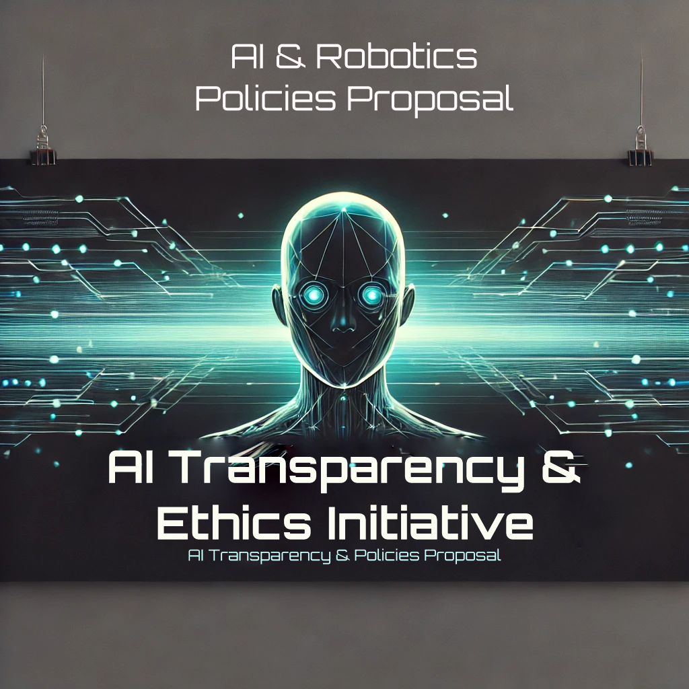

# AI & Robotics Policies Proposal  

### Ensuring Ethical, Safe, and Sustainable Integration into Society  

Welcome to the **AI & Robotics Policies Proposal** repository. This project aims to develop comprehensive policies that ensure ethical practices, safety, and public accountability in AI and robotics. By making this open-source, we invite contributions from policymakers, technologists, and the global community to create a future where technology benefits everyone—not just the powerful few.  

---

## 📜 What’s Inside  

- **[Proposal.md](./Proposal.md)**: The full list of policies and guidelines grouped into seven key categories:  
  - [1. Ethical Policies](./Proposal.md#1-ethical-policies)  
  - [2. Safety & Security Policies](./Proposal.md#2-safety--security-policies)  
  - [3. Legal Policies](./Proposal.md#3-legal-policies)  
  - [4. Societal & Cultural Policies](./Proposal.md#4-societal--cultural-policies)  
  - [5. Economic Policies](./Proposal.md#5-economic-policies)  
  - [6. Environmental Policies](./Proposal.md#6-environmental-policies)  
  - [7. Future-Proofing & Long-Term Policies](./Proposal.md#7-future-proofing--long-term-policies)  

Each section contains **collapsible content** for easy reading.  

---

## 🔍 Why This Matters  

AI and robotics are transforming our world at an unprecedented pace. While these technologies hold immense potential for good, they also pose significant risks if left unchecked. **Ethical and transparent development** is critical to ensure AI and robotics serve humanity rather than control it.  

Without robust policies:  
- **Privacy can be violated**, and personal data exploited.  
- **Job markets can be destabilized**, leaving many without work.  
- **Autonomous decision-making systems** could make life-and-death choices without human oversight.  

By contributing to this initiative, you are helping to shape a future where technology promotes fairness, safety, and sustainability for all.  

---

## 🚀 How to Contribute  

We welcome contributions from all backgrounds. Here’s how you can help:  

1. **Read the `Proposal.md` file** to familiarize yourself with the policies.  
2. **Fork this repository** and create a new branch (`feature-add-policy` or `fix-typo`).  
3. **Submit a pull request (PR)** to propose your changes.  

For more details, check out the **[CONTRIBUTING.md](./CONTRIBUTING.md)** file.  

---

## 📢 Disclaimer  

The content in this repository is intended for **informational and educational purposes only**. While we strive for accuracy, some information may reflect evolving technologies and ongoing research. All content is based on publicly available information and documented sources at the time of writing.  

**This is a collaborative, open-source initiative.** Contributions should be fact-based and aligned with the project's mission of ethical and sustainable AI development. The maintainers are not responsible for the misuse or misinterpretation of this information.  

---

## 🌟 Highlights  
- **Open-Source AI Governance**: Ensuring transparency and preventing monopolization.  
- **Safety & Security**: Policies for emergency shutdowns, non-weaponization, and data privacy.  
- **Environmental Responsibility**: Minimizing energy consumption and promoting sustainable AI development.  
- **Future-Proofing**: Creating a living document to adapt policies as AI and robotics evolve.  

---

## 📂 Additional Resources  
- **[FAQ.md](./FAQ.md)**: Frequently asked questions about this initiative.  
- **[ROADMAP.md](./ROADMAP.md)**: Learn about the project’s current and future goals.  
- **[SECURITY.md](./SECURITY.md)**: Guidelines for reporting vulnerabilities and ensuring project security.  

---

## 📬 Contact  

If you have questions or suggestions, feel free to open an issue or reach out on social media.  

---

## 🛠 License  

This project is licensed under the **MIT License**. See the [LICENSE](./LICENSE) file for details.  
